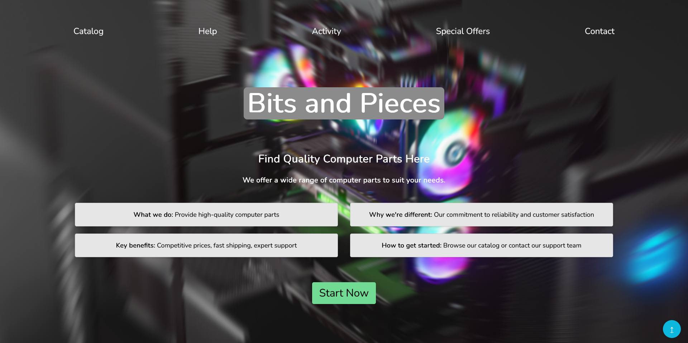

# Bits and Pieces

Welcome to the Bits and Pieces Store!

This website serves as an online platform for purchasing high-quality computer parts. Whether you're a gamer, a professional, or building your own PC, we offer a wide range of components to meet your needs.

## Landing Page

## Features

- **Extensive Catalog:** Explore our diverse selection of computer parts, including CPUs, GPUs, RAM, motherboards, storage devices, and more.
- **Competitive Pricing:** We strive to offer competitive prices on all our products, ensuring you get the best value for your money.
- **Fast Shipping:** Enjoy fast and reliable shipping options to get your components delivered to your doorstep promptly.
- **Expert Support:** Need assistance? Our knowledgeable support team is here to help you with any questions or concerns you may have about our products or services.
- **Tested and Trusted:** With proof of activity in the domain and positive reviews from satisfied customers, you can trust us to provide reliable computer parts.

## Getting Started

To start browsing our catalog and purchasing computer parts, simply visit our website at [www.bitsandpieces.com](https://syn4z.github.io/PWeb-Labs/).

If you have any inquiries or require support, feel free to contact our support team through the provided contact information on our website.

Thank you for choosing Bits and Pieces for your computer hardware needs!
