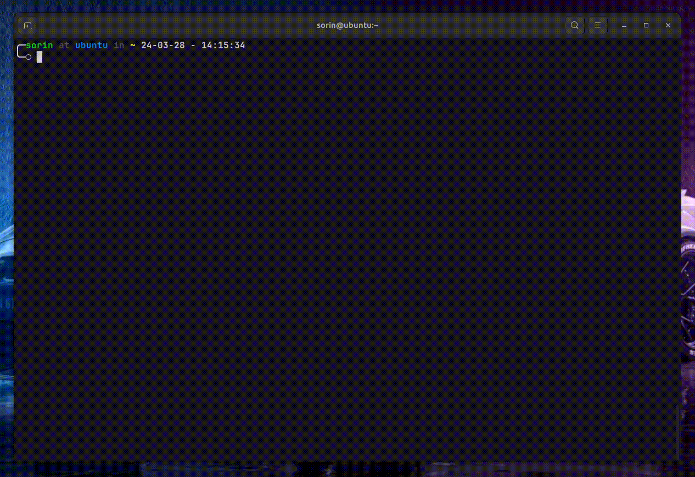

# Command line Program

## Description

This is a command line program that allows the user to interact with the program through the command line. The user can make an HTTP request to the specified URL, make an HTTP request to search the term, and show help. The HTTP requests cache is stored in a `cache.pkl` serialized file.

## Live Demo

